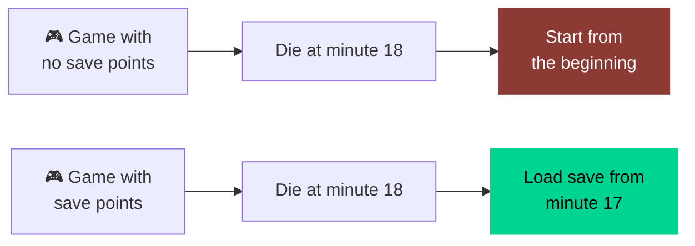
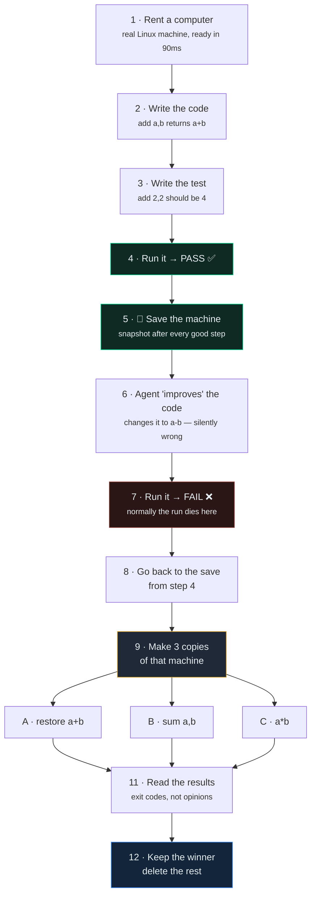

# Rewind

**AI agents have no save points.** Rewind saves the whole machine after every step that works, so when the agent breaks something you go back — and try several fixes at once instead of guessing.



Today, running an AI agent is the top row. Rewind makes it the bottom row.

---

## Before you present

**Setup — do this before you walk up:**

```bash
# terminal 1 — leave running
python -m http.server 8000

# terminal 2 — ready to go, do not press enter yet
cd ~/Documents/daytona-hackathon/rewind
source .venv/bin/activate
set -a; source .env; set +a
rm -f fixtures/tree.json          # so the tree builds live on screen
```

**Checklist:**

- [ ] Console open at `localhost:8000/ui/console.html`, showing an empty timeline
- [ ] Terminal beside it, command typed, cursor waiting
- [ ] `fixtures/tree.json` deleted — the tree must build live, not appear pre-filled
- [ ] One sandbox already warm, so first-call latency is not inside the demo
- [ ] Backup recording open in a background browser tab
- [ ] Font size up in both the terminal and the browser
- [ ] Everything else closed — no Slack, no notifications, no other tabs
- [ ] Contract tests re-run within the last thirty minutes, so you know the key is live

**Screen layout:** browser on the left two-thirds, terminal on the right third. The audience should see the tree grow and the sandbox IDs print at the same time.

**Who does what:** one person talks, one person drives. The driver never talks; the talker never touches the keyboard.

---

## The twelve steps



---

## Step by step, with what's really happening

**1 · Rents a computer from Daytona**
A real Linux machine in the cloud with its own kernel, filesystem and disk, ready in under 90ms. Not a container we're sharing, not a simulation. The agent gets root on a throwaway box.

**2 · Writes a file on it: `add(a,b)` returns `a+b`**
Runs `echo 'def add(a,b): return a+b' > calc.py` inside that machine. The file physically exists on remote disk. We capture the exit code and any output.

**3 · Writes a test file: `add(2,2)` should be `4`**
Same thing — a real assertion written to disk beside the code.

**4 · Runs the test → passes**
A real `python3` process executes on that machine and exits 0. That zero is the machine's verdict, not ours.

**5 · Takes a photo of the computer after each step that worked**
`create_snapshot()` captures the entire filesystem as a reusable image, in about 7 seconds. Not a copy of the file — the whole machine: installed packages, environment, everything the agent touched.

**6 · Changes `add` to `a-b` — a mistake**
The write succeeds, so this step reports *ok*. That's the point: the damage is silent. Nothing tells you anything is wrong yet.

**7 · Runs the test → fails**
Python raises `AssertionError` and exits non-zero. On screen the step turns red. **This is where a normal agent run dies.**

**8 · Goes back to the photo from step 4**
We select the last checkpoint that passed. Its snapshot still exists — the working code was never really lost, it was just overwritten inside a machine nobody had saved.

**9 · Makes three copies of that computer, with the good code restored**
Three new sandboxes created from that one snapshot, about 7 seconds total. Each is fully independent with its own disk. They start identical and diverge from there.

**10 · Tries a different fix on each copy, all at the same time**
Branch A restores `a+b`, B uses `sum([a,b])`, C tries `a*b`. Three real Python processes on three real machines, running in parallel — not one after another.

**11 · Reads which ones passed and which failed**
The critic looks only at exit codes and output from those machines. It never sees an agent's description of what it did. **Evidence, not narration.**

**12 · Keeps the winner, deletes the other two computers**
The winning machine becomes the new head of the run, so you can branch again from it. The losers are destroyed immediately, so nothing keeps billing. Real sandbox IDs are on screen throughout — every one of these was an actual machine.

---

## Why a calculator

Small enough that anyone follows it in ten seconds, deterministic so it behaves identically every run, and the bug is visible on screen.

The mechanism is the same at any size. Replace the calculator with an agent refactoring thirty files for twenty minutes, and the twenty minutes you never have to repeat is the product.


