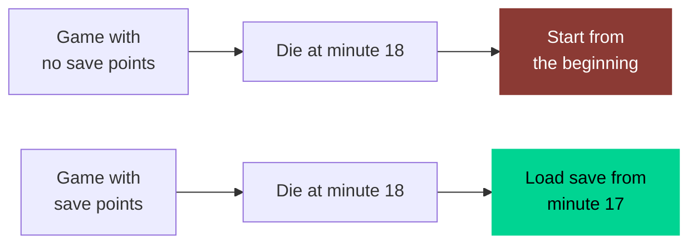
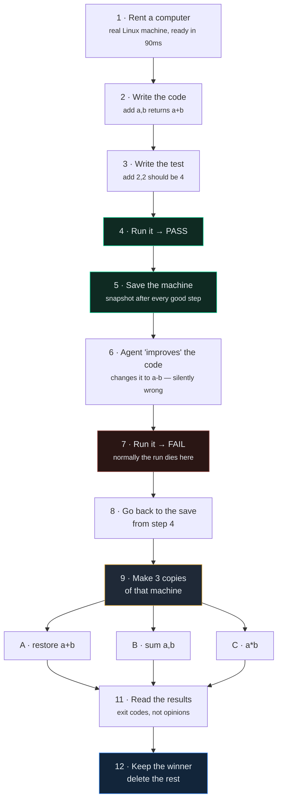
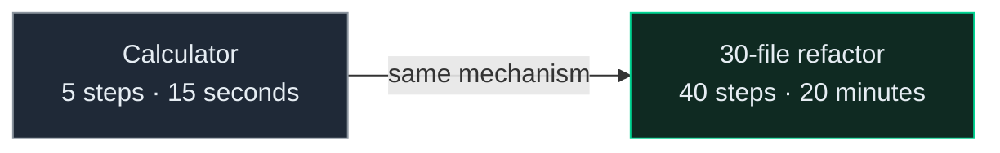
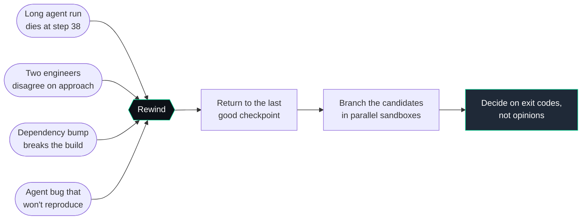
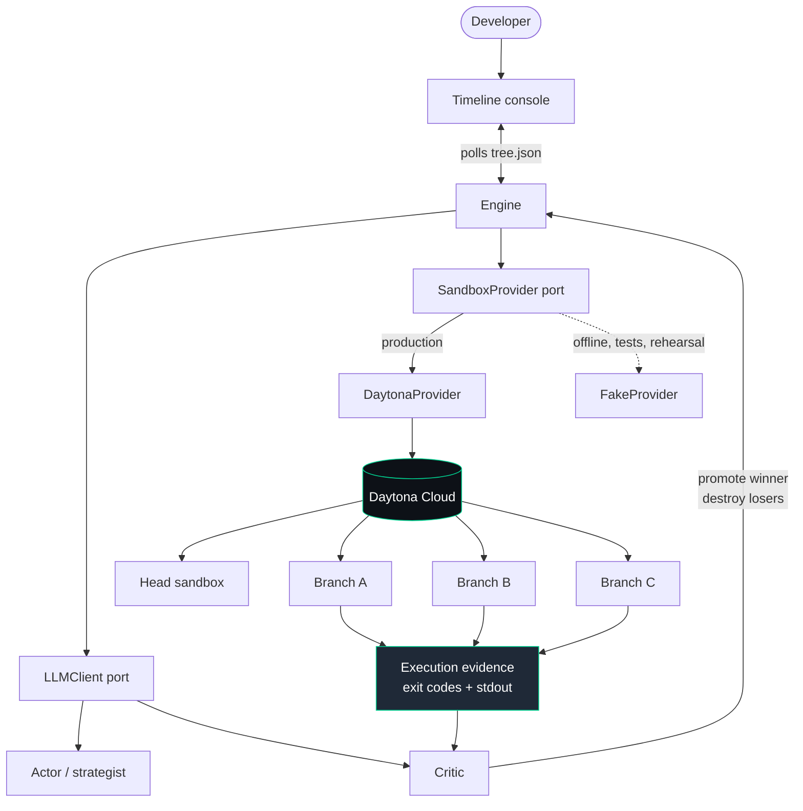
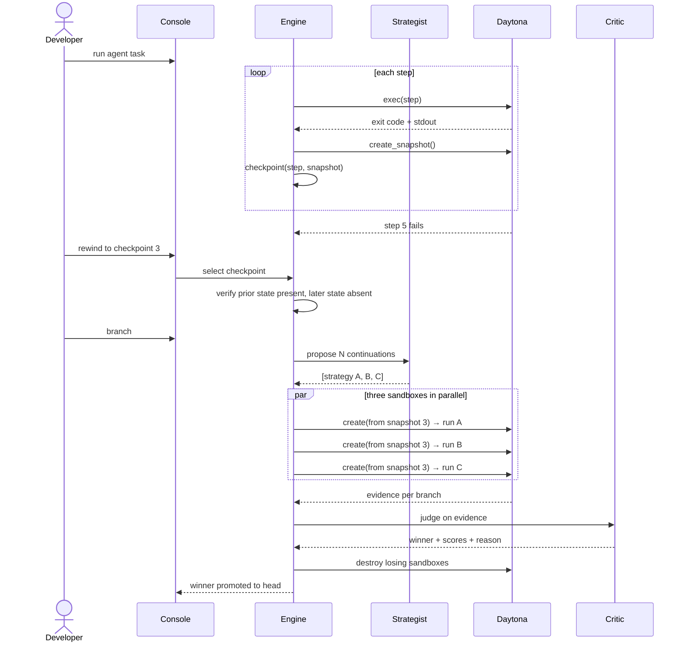
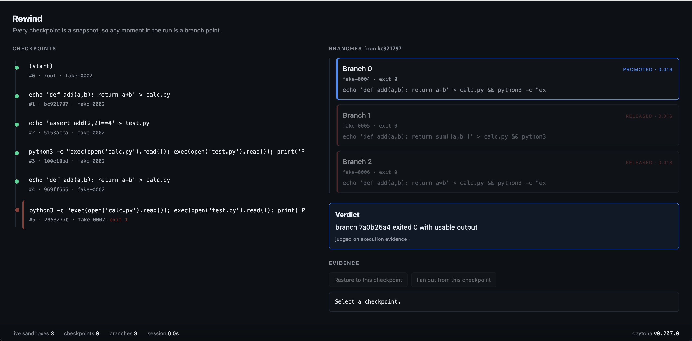

# Rewind

**Undo for AI agents.** Long agent runs fail deep and there is no way back — you restart from step 1 and re-burn every token and every minute. Rewind checkpoints the sandbox after every step, lets you return to any earlier state, and branches parallel candidate continuations from that exact moment on real machines.

Built at Daytona HackSprint Singapore, 29 August 2026.

---

## Summary

| | |
|---|---|
| **What it is** | A runtime that makes AI agent execution rewindable and branchable |
| **Problem solved** | An agent that fails at step 40 forces a restart from step 1. Runs leave a transcript, not resumable state |
| **How** | Snapshot the sandbox after every step; create N independent sandboxes from any snapshot; run competing continuations in parallel; promote the winner on execution evidence |
| **Why Daytona** | Only a runtime that snapshots a live machine and spawns independent copies in seconds makes branching cheap enough to be interactive. Measured: 6.9s to snapshot, 6.8s for three branches |
| **Multi-agent loop** | Strategist proposes → sandboxes execute → critic judges on exit codes and stdout → winner promoted, losers destroyed → repeat from the new head |
| **Status** | Working end to end on live sandboxes. Run `python demo.py` |
| **Repo** | Public from the first commit, three governance gates as git tags |

## The problem

An agent fails at step 40 of 50. Your options today are to run it again from the beginning, or to give up. And the question you actually want answered — *what if it had chosen differently at step 12?* — is unanswerable, because an agent run leaves a transcript, not state.

Transcripts are not resumable. State is. Rewind makes agent execution **branchable**: every step is a checkpoint, and any checkpoint is a branch point.

## A concrete example

Think of a video game with no save points. You play for an hour, die, and start again from the beginning.



Running an AI agent today is the top row. Rewind makes it the bottom row.

Here is a small agent, asked to write a calculator and make its test pass:



Step 3 worked. Step 6 broke it. But the working code from step 3 is gone — overwritten inside a computer that gets deleted when the run ends. Your only option is to start again from step 1.

**Rewind saved the machine at every good step.** So it loads the save from step 4 and tries three fixes at once, each on its own computer:

| Branch | Fix it tries | Test result |
|---|---|---|
| A | back to `a + b` | PASS |
| B | `sum([a, b])` | PASS |
| C | `a * b` | FAIL |

A critic agent looks at which ones actually passed — not at what the agents claim they did — keeps A, and deletes the other two computers.

Under fifteen seconds. Three machines. Steps 1 to 4 never lost.

Now swap the calculator for a real task — an agent refactoring thirty files for twenty minutes before it goes wrong. The twenty minutes you don't have to repeat is the product.



A step-by-step account of what happens on each of the twelve steps is in [`docs/DEMO-WALKTHROUGH.md`](docs/DEMO-WALKTHROUGH.md).

## Who this is for

Four situations, one shape: something goes wrong after a lot of work, and the only state that could save you is already gone.



### The developer running a long agentic task

You give Claude Code or a similar agent a refactor spanning thirty files. Twenty minutes in, it takes a wrong turn at step 12 and everything after is built on it. Right now you kill it and start over, paying for those twenty minutes twice. With Rewind you scrub back to step 11, correct the instruction, and continue — keeping the eleven steps that were fine.

### The team that cannot decide between two approaches

Two engineers disagree about how to fix something and the argument is unresolvable in the abstract. Rewind runs both from the same starting state, in isolated sandboxes, and returns exit codes and test output for each. The disagreement becomes an experiment that takes ninety seconds.

### The migration or upgrade nobody wants to run twice

A dependency bump breaks the build in a way that could have several fixes. Branch three candidate fixes from the pre-bump checkpoint, run the test suite in all three simultaneously, and see which actually passes rather than which sounds most plausible.

### Anyone building agents who needs to debug them

Agent failures are hard to reproduce because the state that produced them is gone the moment the run ends. A checkpoint tree is a debugger for agent runs: stop at the failing step, inspect the machine as it was, change one thing, re-run just that part.

## What makes it possible

A Daytona sandbox is a full machine — dedicated kernel, filesystem, network stack, vCPU, RAM and disk — ready in under 90ms. Two of its lifecycle operations are what this is built on:

- **`create_snapshot()`** captures a running sandbox's filesystem as a reusable image. That is a checkpoint.
- **Creating from that snapshot** produces independent machines that begin with identical state and diverge from there. That is a branch.

Verified on the day: snapshot in ~6.9s, three branches created from one snapshot in 6.8s total, children carrying full parent state. The account's concurrency ceiling was 10 vCPU, so branching is capped at three plus the head.

There is also a `fork()` operation for live VM-class sandboxes, which would make branching cheaper still. It returned `422 Forking is not supported for this sandbox` on our container-class tier, so the snapshot path is what ships. The provider port hides which mechanism is in use, so enabling fork later changes one method body and nothing else.

## The feedback loop

This is not a model narrating its work. Branches are judged on evidence their own sandboxes produced:

1. A strategist proposes several distinct continuations from the chosen checkpoint.
2. Each runs in its own isolated sandbox, in parallel.
3. Exit codes and stdout are captured per branch — the agent's description of the outcome is never substituted for this.
4. A critic ranks the branches on that evidence and promotes one to be the new head.
5. Losing sandboxes are destroyed. The promoted branch can be branched again.

When the critic is unavailable or returns a malformed verdict, a deterministic ranking over exit status takes over and the fallback is recorded. The loop never depends on a model being reachable.

---

## Architecture



The two ports are the whole design. Everything above them is testable offline against fakes; everything below them is one vendor.

## The loop, in sequence




**Reading the diagram:**

1. **Run** — the agent works step by step. Each instruction executes inside the head sandbox.
2. **Capture** — the exit code and stdout come back from that machine. This is evidence, and it is the only thing later decisions are allowed to use.
3. **Checkpoint** — a snapshot of the filesystem is taken after every successful step, and stored against that step in the tree.
4. **Fail** — a step exits non-zero. The branch stops. Nothing before it is discarded.
5. **Rewind** — you pick an earlier checkpoint. The engine confirms it by showing that state written before it is present and state written after it is gone.
6. **Propose** — the strategist returns several distinct continuations from that point, as structured data rather than prose.
7. **Branch** — one sandbox per strategy, all created from the same snapshot, running in parallel. Each carries the full state of the run at that checkpoint and diverges from there.
8. **Judge** — the critic ranks the branches on their exit codes and output. If it is unreachable or malformed, a deterministic ranking over exit status takes over and the fallback is recorded.
9. **Promote** — the winner becomes the new head. Losing sandboxes are destroyed immediately, and the head can be branched again from here.


---

## The console

Everything the run does is visible on one screen, and everything that came from a sandbox is shown in monospace — so what you see is what the machine reported, not what an agent said about it.



```
┌─────────────────────────────┬───────────────────────────────────┐
│  CHECKPOINTS                │  BRANCHES                         │
│                             │                                   │
│  ● #1  write calc.py        │  ┌─ Branch A ────── promoted ─┐   │
│  ● #2  write test.py        │  │ sbx-4f89… · exit 0         │   │
│  ● #3  run test    ← save   │  └────────────────────────────┘   │
│  ● #4  change to a-b        │  ┌─ Branch B ────── released ─┐   │
│  ● #5  run test    FAILED   │  │ sbx-c268… · exit 0         │   │
│    ▲                        │  └────────────────────────────┘   │
│    └ red rule, extra weight │  ┌─ Branch C ────── released ─┐   │
│                             │  │ sbx-fedd… · exit 1         │   │
│                             │  └────────────────────────────┘   │
│                             │                                   │
│                             │  VERDICT                          │
│                             │  branch A exited 0 fastest        │
│                             │  judged on execution evidence     │
│                             │                                   │
│                             │  EVIDENCE                         │
│                             │  exit code 1                      │
│                             │  AssertionError                   │
└─────────────────────────────┴───────────────────────────────────┘
  live sandboxes 4 · checkpoints 8 · branches 3 · elapsed 14.2s
```

**What the colours mean.** Colour carries state, never decoration:

| | Meaning |
|---|---|
| 🟢 green | a step that succeeded, or a sandbox that exists right now |
| 🔴 red rule | a failed step — given extra space and weight, because it is the moment the run would normally die |
| 🟡 amber | a branch running, verdict still pending |
| 🔵 blue | the branch the critic promoted |
| faded red | a branch that lost and whose sandbox has been destroyed |

**Three moments get visual weight** — the failure, the rewind, and the verdict. Everything else in the timeline stays uniform and quiet, so the eye goes to the parts that matter.

**The footer never leaves the screen:** live sandbox count, checkpoints, branches, and elapsed time. That count going up when branches spawn and down when losers are destroyed is the proof that these are real machines with real lifecycles.

Click any checkpoint or branch to see the evidence behind it — the exit code and output captured from that machine. Where an agent's rationale is shown, it is visually separated from the evidence and labelled as rationale, because the two are never interchangeable.

---

## Run it

```bash
cp .env.example .env      # add DAYTONA_API_KEY
python -m venv .venv && source .venv/bin/activate
pip install -e . && pip install pytest

pytest tests/unit -q      # no network — runs against FakeProvider
FAKE=1 python demo.py     # the whole loop, instantly, offline
python demo.py            # the real thing, on live sandboxes
```

Watch it happen:

```bash
python -m http.server 8000
open http://localhost:8000/ui/console.html
```

The console re-reads `fixtures/tree.json` every two seconds, so leave it open while `demo.py` runs.

**Hosted console** — **https://rewind-console.vercel.app** is the same console rebuilt as a deployable React app (spec 009, in `web/`), for sharing the run view with anyone not at the presenter's machine. It is a shared view, not the live demo — the stage demo still runs locally against `ui/console.html`. Set `REWIND_CONSOLE_ENDPOINT` + `REWIND_CONSOLE_TOKEN` before `python demo.py` (or run `python tools/push_console.py`) to feed it; the push is best-effort and never affects the local run. A **▶ Replay run** button plays the current run's stages back through the view (seed → fail → rewind → fan-out → verdict) with a plain-language caption on each beat — client-only, no engine.

The reasoning layer is provider-agnostic — `LLM_BASE_URL` unset uses the default provider, and `CRITIC_BASE_URL` routes the critic to a separate endpoint. The critic is the natural role to self-host: it is the high-volume one, its inputs are long and its outputs are small, and constrained decoding can guarantee the verdict schema at sampling time.

## What's real, and what isn't

**Working:** step execution in live sandboxes with evidence capture, snapshot-based checkpointing, restore to any checkpoint, three parallel branches from one checkpoint, evidence-based ranking and promotion, sandbox cleanup on every path, live timeline console with real sandbox identifiers.

**Roadmap:** persistence across reload, branch merging, recursive branching more than one generation deep, adapters for existing agent frameworks, per-branch cost accounting, fork-based branching when VM class is available.

This section is here because the difference between shipped and intended is the only honest thing to put in a hackathon README.

## How it was built

Spec-driven, under `docs/constitution.md` — fourteen articles including *Nothing Is Invented* (no runtime capability used unless observed on this account and recorded in `.rewind/daytona-capability-map.md`) and *Evidence Over Assertion*.

Three gates, each a git tag: **G1** scope, **G2** spine proven, **G3** freeze. `tools/spine_test.py` is the script that chose this project — it discovered that `fork()` was unavailable and that the concurrency ceiling was 10 vCPU, both before a line of feature code was written.

## Verified platform behaviour

Every capability below was observed against the live API on the day and recorded in `.rewind/daytona-capability-map.md`. Nothing in this project uses a method that was not first verified on this account.

| Observation | Result | Consequence |
|---|---|---|
| `create_snapshot()` on a running sandbox | works, ~6.9s | this is a checkpoint |
| `create(CreateSandboxFromSnapshotParams(...))` | works, children carry full parent state | this is a branch |
| 3 branches from one snapshot | 6.8s total, parallel | fits inside a live demo beat |
| `fork()` on container-class sandbox | `422 Forking is not supported for this sandbox` | snapshot path ships instead; port hides the difference |
| Concurrency ceiling | total CPU limit 10 | branching capped at 3 + head; config value, not a redesign |
| Sandbox create rate limit | 600/min | not a constraint |
| Sandbox writable workspace | `/home/daytona/...`, not `/work` | fixed before it could bite us |
| API version | v0.207.0 | recorded for reproducibility |

## How this meets the judging criteria

**Completeness — functional MVP proven within the Daytona sandbox runtime.**
`python demo.py` runs the full path against live sandboxes: five agent steps, a real failure, a rewind to the last good checkpoint, three parallel branches, an evidence-based verdict, promotion, and guaranteed cleanup. `FAKE=1 python demo.py` runs the identical logic offline. Unit tests pass with no network; contract tests exercise the live runtime.

**Innovation — beyond prompt wrappers, with a multi-agent feedback loop.**
Three roles, one closed loop: a strategist proposes distinct continuations as structured data, each executes in its own isolated sandbox, and a critic ranks them **on exit codes and stdout captured from those sandboxes** — never on any agent's description of its own work. The verdict promotes one branch to head and destroys the rest, and the promoted head can be branched again. A deterministic ranking over exit status takes over if the critic is unreachable, so the loop never depends on a model being up.

**Real-world fit — a real developer bottleneck.**
Agent runs are not resumable. Every developer running long agentic tasks has lost twenty minutes of correct work to a wrong turn near the end, with no way to ask what a different choice at step 12 would have produced. This is that problem, and the four situations in *Who this is for* are all instances of it.

**Sponsor usage — clever integration with Daytona.**
Daytona is not called by this project; it is the substrate of it. The product is a lifecycle pattern — snapshot the head, spawn N independent machines from that snapshot, execute in parallel, destroy the losers — that cannot exist without a runtime giving each branch a full machine in seconds. We probed `fork()`, hit a real tier boundary, recorded it, and shipped the mechanism that works, behind a port that will accept fork unchanged when VM class is available.

## Repository map

```
README.md                       this file
docs/constitution.md            14 governance articles, ratified before any code
docs/gates.md                   G1/G2/G3 with times, mirrored as git tags
specs/                          the specifications, written before implementation
.rewind/daytona-capability-map.md   what was verified on the live API
src/rewind/ports.py             SandboxProvider + LLMClient — the seam
src/rewind/providers.py         DaytonaProvider (real) + FakeProvider (offline)
src/rewind/engine.py            checkpoint tree, step loop, branching, promotion
demo.py                         the end-to-end path
ui/console.html                 the timeline console
web/                            the timeline console as a deployable React app (spec 009)
tools/push_console.py           mirror fixtures/tree.json to the hosted console
tests/unit                      pure logic, no network
tests/contract                  live runtime and reasoning endpoint
tools/spine_test.py             the script that chose this project
```

## License

MIT
